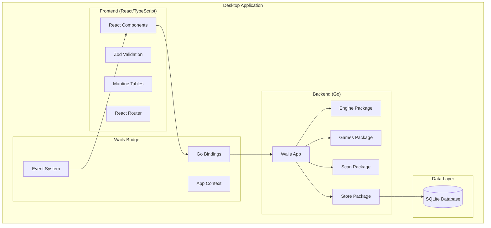

# Design Document

## Overview

The Wails Desktop App design transforms the existing Stake PF Replay web service into a single-binary desktop application. The architecture leverages Wails v2 to bridge the high-performance Go backend with a modern React frontend, eliminating network dependencies while maintaining the fast scanning capabilities of the original engine.

The design preserves the existing `internal/engine`, `internal/games`, `internal/scan`, and `internal/store` packages while introducing new Wails-specific components for desktop integration and a React-based user interface.

## Architecture

### High-Level Architecture



### Package Structure

```
pf-replay/
├── backend/
│   ├── app/                    # Wails application layer
│   │   ├── bindings.go        # Exposed functions to frontend
│   │   ├── events.go          # Event emission for progress
│   │   ├── config.go          # App configuration
│   │   └── app.go             # Main app struct
│   ├── engine/                # Existing: HMAC-SHA256 & RNG
│   ├── games/                 # Existing: Game implementations
│   ├── scan/                  # Existing: High-performance scanning
│   ├── store/                 # Enhanced: SQLite operations
│   │   ├── schema.sql         # Database schema
│   │   ├── runs.go           # Run CRUD operations
│   │   └── hits.go           # Hit CRUD operations
│   ├── version/               # Version information
│   └── main.go               # Wails bootstrap
├── frontend/
│   ├── src/
│   │   ├── app/              # Next.js-style routing
│   │   │   ├── page.tsx      # Scan form
│   │   │   ├── runs/
│   │   │   │   ├── page.tsx  # Runs list
│   │   │   │   └── [id]/
│   │   │   │       └── page.tsx # Run details
│   │   │   └── layout.tsx
│   │   ├── components/       # React components
│   │   ├── lib/             # Utilities & schemas
│   │   └── styles/          # CSS styles
│   ├── package.json
│   └── tsconfig.json
├── wails.json               # Wails configuration
└── go.mod
```

## Components and Interfaces

### Wails Bindings Interface

The bindings layer exposes Go functions to the React frontend through Wails' automatic binding generation:

```go
// backend/app/bindings.go
type App struct {
    ctx   context.Context
    store *store.Store
}

// Core data structures
type ScanRequest struct {
    Game       string            `json:"game"`
    Seeds      Seeds            `json:"seeds"`
    NonceStart uint64           `json:"nonceStart"`
    NonceEnd   uint64           `json:"nonceEnd"`
    Params     map[string]any   `json:"params"`
    TargetOp   string           `json:"targetOp"`
    TargetVal  float64          `json:"targetVal"`
    Tolerance  float64          `json:"tolerance"`
    Limit      int              `json:"limit"`
    TimeoutMs  int              `json:"timeoutMs"`
}

type ScanResult struct {
    RunID         int64       `json:"runId"`
    Hits          []Hit       `json:"hits"`
    Summary       Summary     `json:"summary"`
    EngineVersion string      `json:"engineVersion"`
    Echo          ScanRequest `json:"echo"`
    TimedOut      bool        `json:"timedOut"`
    ServerSeedHash string     `json:"serverSeedHash"`
}

// Exposed binding functions
func (a *App) GetGames() ([]GameInfo, error)
func (a *App) HashServerSeed(server string) (string, error)
func (a *App) StartScan(req ScanRequest) (ScanResult, error)
func (a *App) GetRun(runID int64) (Run, error)
func (a *App) GetRunHits(runID int64, page, perPage int) (HitsPage, error)
func (a *App) ListRuns(q RunsQuery) (RunsList, error)
func (a *App) CancelRun(runID int64) error
```

### React Component Architecture

```typescript
// frontend/src/lib/types.ts
interface ScanFormData {
  serverSeed: string;
  clientSeed: string;
  nonceStart: number;
  nonceEnd: number;
  game: string;
  params: Record<string, any>;
  targetOp: 'ge' | 'gt' | 'eq' | 'le' | 'lt';
  targetVal: number;
  tolerance: number;
  limit: number;
  timeoutMs: number;
}

// Component hierarchy
ScanForm -> Zod validation -> StartScan binding
RunsList -> ListRuns binding -> RunsTable component
RunDetails -> GetRun + GetRunHits bindings -> RunSummary + HitsTable
```

### Database Schema Design

```sql
-- Enhanced schema for desktop app
CREATE TABLE IF NOT EXISTS runs (
    id INTEGER PRIMARY KEY AUTOINCREMENT,
    created_at TEXT NOT NULL DEFAULT (datetime('now')),
    game TEXT NOT NULL,
    engine_version TEXT NOT NULL,
    server_seed_hash TEXT NOT NULL,  -- SHA256 only, never raw seed
    client_seed TEXT NOT NULL,
    nonce_start INTEGER NOT NULL,
    nonce_end INTEGER NOT NULL,
    params_json TEXT NOT NULL,
    target_op TEXT NOT NULL,
    target_val REAL NOT NULL,
    tolerance REAL NOT NULL,
    hit_limit INTEGER NOT NULL,
    timed_out INTEGER NOT NULL DEFAULT 0,
    total_evaluated INTEGER NOT NULL DEFAULT 0,
    summary_min REAL,
    summary_max REAL,
    summary_sum REAL,
    summary_count INTEGER NOT NULL DEFAULT 0
);

CREATE TABLE IF NOT EXISTS hits (
    run_id INTEGER NOT NULL REFERENCES runs(id) ON DELETE CASCADE,
    nonce INTEGER NOT NULL,
    metric REAL NOT NULL,
    PRIMARY KEY (run_id, nonce)
);

-- Optimized indexes for desktop performance
CREATE INDEX IF NOT EXISTS idx_hits_run_nonce ON hits(run_id, nonce);
CREATE INDEX IF NOT EXISTS idx_runs_created ON runs(created_at);
CREATE INDEX IF NOT EXISTS idx_runs_game ON runs(game);
```

## Data Models

### Core Domain Models

```go
// Scan execution context
type ScanContext struct {
    Request    ScanRequest
    RunID      int64
    StartTime  time.Time
    CancelFunc context.CancelFunc
    Progress   *ScanProgress
}

// Real-time progress tracking
type ScanProgress struct {
    Evaluated   uint64  `json:"evaluated"`
    HitsFound   uint64  `json:"hitsFound"`
    RatePerSec  float64 `json:"ratePerSec"`
    ElapsedMs   int64   `json:"elapsedMs"`
}

// Hit with computed delta
type HitWithDelta struct {
    Hit
    DeltaNonce *uint64 `json:"deltaNonce,omitempty"`
}
```

### Game Integration Models

```go
// Game registry for dynamic loading
type GameInfo struct {
    ID          string `json:"id"`
    Name        string `json:"name"`
    MetricLabel string `json:"metricLabel"`
}

// Game parameter validation
type GameParams interface {
    Validate() error
    ToMap() map[string]any
}
```

## Error Handling

### Error Classification

1. **Validation Errors**: Input validation failures with field-specific messages
2. **Runtime Errors**: Scan execution failures with context preservation
3. **Database Errors**: Storage operation failures with transaction rollback
4. **System Errors**: Resource exhaustion or OS-level failures

### Error Response Strategy

```go
// Structured error responses for frontend
type AppError struct {
    Code    string `json:"code"`
    Message string `json:"message"`
    Field   string `json:"field,omitempty"`
    Details any    `json:"details,omitempty"`
}

// Error handling patterns
func (a *App) StartScan(req ScanRequest) (ScanResult, error) {
    if err := validateScanRequest(req); err != nil {
        return ScanResult{}, &AppError{
            Code:    "VALIDATION_ERROR",
            Message: "Invalid scan parameters",
            Details: err.ValidationErrors(),
        }
    }
    // ... execution logic
}
```

### Frontend Error Handling

```typescript
// Error boundary and toast notifications
const handleScanSubmit = async (data: ScanFormData) => {
  try {
    const result = await StartScan(data);
    navigate(`/runs/${result.runId}`);
  } catch (error) {
    if (error.code === 'VALIDATION_ERROR') {
      // Show field-specific errors
      setFieldErrors(error.details);
    } else {
      // Show general error toast
      showErrorToast(error.message);
    }
  }
};
```

## Testing Strategy

### Unit Testing

1. **Go Backend Tests**:
   - Game logic correctness with golden vectors
   - HMAC-SHA256 deterministic behavior
   - Database operations with in-memory SQLite
   - Scan engine performance benchmarks

2. **React Frontend Tests**:
   - Component rendering with React Testing Library
   - Form validation with Zod schemas
   - Mocking Wails bindings for isolated testing

### Integration Testing

1. **End-to-End Workflows**:
   - Complete scan execution from form to results
   - Database persistence across app restarts
   - Cancellation and timeout handling

2. **Performance Testing**:
   - Large nonce range scanning (1M+ nonces)
   - Memory usage stability during long scans
   - UI responsiveness during background processing

### Golden Vector Testing

```go
// Deterministic test cases for each game
func TestLimboGoldenVectors(t *testing.T) {
    vectors := []struct {
        serverSeed string
        clientSeed string
        nonce      uint64
        expected   float64
    }{
        {"test_seed", "client_123", 1, 1.23},
        // ... more vectors
    }
    
    for _, v := range vectors {
        result := limbo.Evaluate(generateFloats(v.serverSeed, v.clientSeed, v.nonce))
        assert.Equal(t, v.expected, result.Metric)
    }
}
```

## Performance Considerations

### Scanning Optimization

1. **Worker Pool Sizing**: Use `runtime.GOMAXPROCS(0)` for optimal CPU utilization
2. **Memory Management**: Pre-allocate buffers and reuse HMAC instances
3. **Batch Processing**: Group database writes to reduce I/O overhead
4. **Context Cancellation**: Respect cancellation signals for responsive UI

### Database Performance

1. **Batch Inserts**: Insert hits in batches of 1000 for optimal throughput
2. **Transaction Management**: Use transactions for consistency without blocking
3. **Index Strategy**: Optimize for common query patterns (run_id, nonce ordering)

### UI Responsiveness

1. **Background Processing**: Execute scans in goroutines to avoid blocking UI
2. **Progress Updates**: Emit progress events every 250ms for smooth feedback
3. **Pagination**: Server-side pagination for large result sets
4. **Virtual Scrolling**: Consider virtual scrolling for very large hit tables

## Security and Privacy

### Data Protection

1. **Seed Handling**: Never store or display raw server seeds
2. **Hash-Only Storage**: Store SHA256(serverSeed) for identification
3. **Local-Only Processing**: No network communication after app initialization
4. **Secure Deletion**: Provide option to clear scan history

### Application Security

1. **Input Validation**: Comprehensive validation at all entry points
2. **SQL Injection Prevention**: Use parameterized queries exclusively
3. **Resource Limits**: Enforce reasonable limits on scan parameters
4. **Error Information**: Avoid exposing sensitive details in error messages

## Deployment and Distribution

### Build Configuration

```json
// wails.json
{
  "name": "pf-replay",
  "outputfilename": "PF-Replay",
  "frontend:install": "pnpm install",
  "frontend:build": "pnpm build",
  "backend:mod": "./go.mod",
  "backend:build": "go build -ldflags '-w -s' -o bin/pf-replay ./main.go"
}
```

### Platform-Specific Considerations

1. **Windows**: Single .exe with embedded resources
2. **macOS**: .app bundle with proper code signing
3. **Linux**: AppImage or native binary with desktop integration

### Database Location

- **Windows**: `%APPDATA%/PF-Replay/data.db`
- **macOS**: `~/Library/Application Support/PF-Replay/data.db`
- **Linux**: `~/.local/share/PF-Replay/data.db`